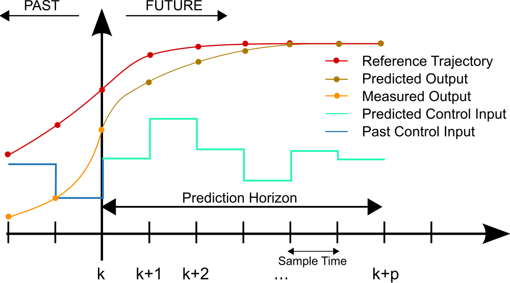
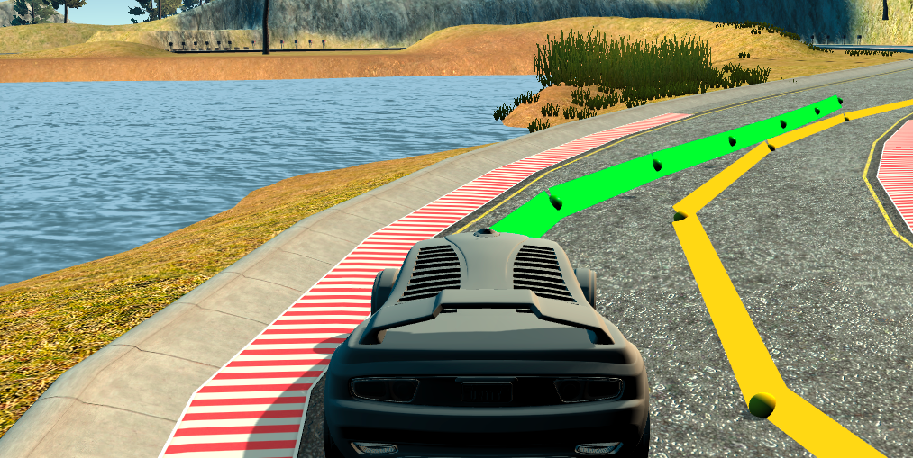
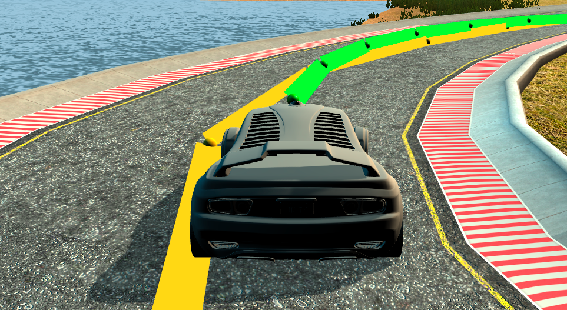

# Track-Maneuvering-using-MPC-Control

# Overview

To design and implement a Model-Predictive-Control (MPC) controller for an autonomous vehicle to successfully maneuver around a complex track which has lots sharp turns. The controller receives measurements from the vehicle such as:
1. The “px” and “py” (the vehicle’s current x and y positions) measured in the global “map” coordinates.
2. The vehicle speed “speed” at the given instance measured in miles/hour (mph).
3. The vehicle orientation angle “Ψ” (-ve for left and +ve for right) in radians.
4. The vehicle orientation angle “Ψ-unity” in radians commonly used in navigation.
5. The current steering angle of the vehicle “steering_angle” measured in radians.
6. The current throttle value “throttle” given in the range [-1, 1] where (-ve for braking and +ve for speeding).
7. The `ptsx` and `ptsy` are two arrays that include the waypoints measured in global coordinates.
The MPC controller then uses some of the above information to produce a steer (angle) command to the vehicle in addition to a throttle command (speed).

This repository contains all the code and data needed to design and implement a Model-Predictive-Control (MPC) controller for an autonomous vehicle to successfully maneuver around a complex track which has lots sharp turns. The project uses [this simulator](https://github.com/udacity/self-driving-car-sim/releases) to design, test and evaluate the controller.

The full details of the project implementation (developed in C++) and the design of the PID controller can be found [in this report](https://github.com/wafarag/Track-Maneuvering-using-MPC-Control/blob/master/MPC-Report1.pdf).

## Running the Code

* All the source code of the project is available [here](https://github.com/wafarag/Track-Maneuvering-using-MPC-Control/tree/master/src).

* The project uses both "Ipopt" and "CppAD" libraries. Please refer to [this document](https://github.com/udacity/CarND-MPC-Project/blob/master/install_Ipopt_CppAD.md) for installation instructions. "Ipopt" is a comprehensive library to solve an optimization problem using Interior-Point techniques given an optimization function and a set of constraints. "CppAD" is another comprehensive library to calculate gradients (deriavatives) and make differerntiations.

* [Eigen](http://eigen.tuxfamily.org/index.php?title=Main_Page). This is a comprehensive library for matrix manipulation. Please unzip [this file](https://github.com/wafarag/Track-Maneuvering-using-MPC-Control/blob/master/src/Eigen-3.3.zip) in the same "src" directory before using the code.

* Simulator. You can download these from the [releases tab](https://github.com/udacity/self-driving-car-sim/releases).

